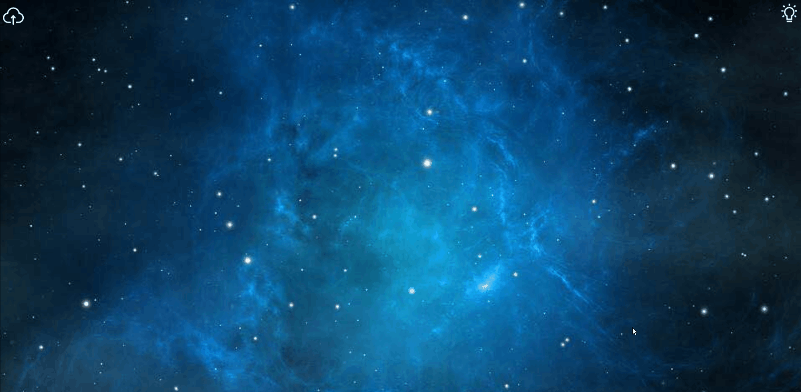

# Puzzle Game

## 游戏方式
玩家上传图片后选择游戏难度（也就是要分割成的碎片数量），一颗星代表 2 \* 2 = 4 个碎片， 两颗星代表 3 \* 3 = 9 个碎片，以此类推八颗星则是 81 个碎片。通过拖拽碎片进行拼图，当每个碎片和其相邻的碎片间隔都不超过阈值时，则拼图成功。

## 博客总结
👉 [DangoSky' blog](http://blog.dangosky.com/2019/05/03/Puzzle-Game/)

## 游戏截图

